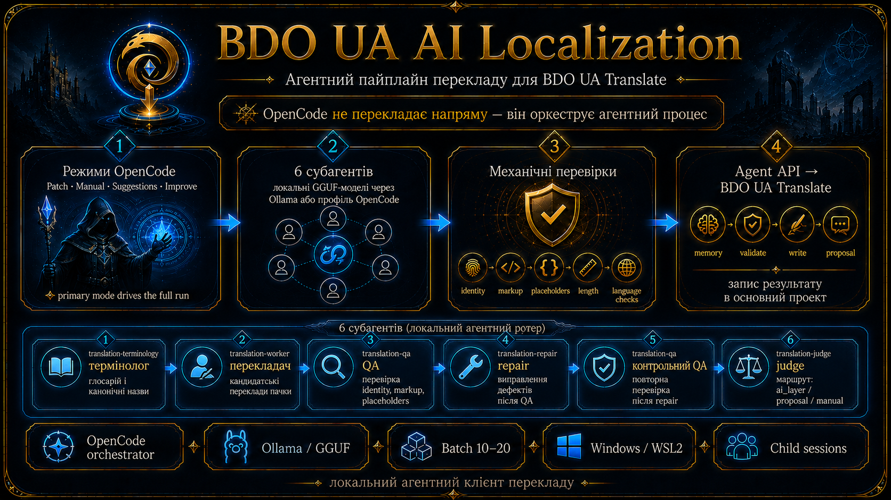

# bdo-ua-ai-localization



Набір інструментів для перекладу рядків **Black Desert Online** українською для
проєкту [BDO UA Translate](https://bdo-ua.com.ua).

Працює це так: ви відкриваєте проєкт у **[OpenCode](https://opencode.ai)** і
кажете диригенту звичайною мовою, що перекласти. Далі він сам веде процес,
викликаючи **субагентів** на вибраних моделях OpenCode і
детерміновані перевірки між ними. Платна модель диригує й **сама не перекладає**.

Перед записом кожен рядок проходить механічні перевірки: незмінність identity,
розмітка, placeholders, межі довжини, словник русизмів, латинські гомогліфи в
кирилиці.

## Про проєкт

- Робота починається з вибору режиму OpenCode: активний патч, ручний шар,
  пропозиції або поліпшення ШІ-шару. Режим сам веде всі пачки до нульового
  залишку через відновлюваний `run drive`.
- Мовну роботу роблять пʼять вузьких субагентів. За замовчуванням це локальні
  GGUF-моделі; окремий профіль може використати Zen або інший OpenCode provider.
  Платний маршрут ніколи не вмикається приховано.
- Формат відповіді субагента прибитий JSON-схемою, тому він не може загубити,
  здублювати чи вигадати ідентифікатор рядка.
- Пачками по 15 рядків (діапазон 10-20), з памʼяттю перекладів і глосарієм: половина рядків
  закривається без виклику моделі взагалі.
- У ШІ-шар пишеться все, що має текст. Черга модерації · для ручного шару, де
  проблемний рядок справді потребує людини.
- Один прогін · одне середовище, зафіксоване до першої пачки.
- Кожен крок має штатну команду `./bdo`; свій `curl` до API заборонений.

**Чого тут немає.** Це клієнт, а не сервер: ні бази даних, ні вебзастосунку, ні
адмінки, ні самого API. Уся серверна логіка живе в окремому проєкті, а цей набір
лише читає й пише через Agent API.

Повністю скриптовий флоу без чату колись існував, але **видалений** 2026-08-22:
робочий флоу один. Код лишився в історії Git · коміт `dac631e`.

## Windows і моделі субагентів

Windows підтримується через WSL2, тим самим Bash/PHP flow без копії на
PowerShell. Репозиторій краще клонувати у Linux filesystem WSL (`~/GitHub`), а
не в `/mnt/c`; після встановлення залежностей виконайте `./bdo gate preflight`.
Повна покрокова інструкція: [Windows через WSL2](docs/WINDOWS_WSL2.md).

Моделі всіх ролей задає `.opencode/translation-models.json`. Ключі провайдерів
налаштовуються лише через OpenCode `/connect` і не потрапляють у проєкт:

```bash
./bdo profile status
./bdo profile quality                         # локальний quality
./bdo profile fast                            # локальний fast
./bdo profile set zen-free all opencode/MODEL free
./bdo profile use zen-free
./bdo profile fallback zen-free translation-worker PROVIDER/MODEL free
```

`MODEL` береться з актуального `/models` у OpenCode: назви та безкоштовність
зовнішніх моделей можуть змінюватися. Для платної моделі треба явно вказати
`paid`; прихований платний fallback policy не пропускає. Після зміни профілю
перезапустіть OpenCode і попросіть: `Запусти smoke та покажи фактичний
provider/model`. Зручний варіант для власника — задати в локальному `.env`
`TRANSLATE_MODEL_PROFILE=session-free|local-fast|local-quality`: кожен виклик
`./bdo env` синхронізує цей профіль із child-конфігом, а основну модель не змінює.
За потреби конкретну модель активного профілю можна зафіксувати через
`TRANSLATE_MODEL=provider/model-id`; порожнє значення повертає штатну модель
профілю. Для платного override додайте `TRANSLATE_MODEL_COST=paid`, інакше
залиште `free`. Профіль має дозволити платні маршрути.
При зафіксованому `TRANSLATE_MODEL` будь-який child із іншою моделлю блокується
routing guard до початку генерації.
Primary виконає `./bdo smoke`; цей smoke не запускає patch, не
звертається до API і не потребує PHP для підготовки envelope. Для Ollama повний
capability test виконує `./bdo runtime`; зовнішні credentials навмисно не
обходяться прямим HTTP-запитом.

Кожна мовна роль запускається штатним OpenCode Task і показується як child
session, яку можна відкрити з батьківської. Її JSON атомарно зберігає
`translation_result`; plugins не створюють сесій самостійно. Runtime guard
блокує будь-який shell/CLI/HTTP/MCP обхід native Task.

У Windows OpenCode та репозиторій мають бути відкриті через WSL2. Залежності
ставляться всередині WSL (`sudo apt install php-cli jq curl git shellcheck`), а
не через `winget`. Якщо вже встановлено лише `qwen3.5:9b`, після PHP виконайте
`./bdo profile fast`; завантажувати 35B модель для smoke не обовʼязково.

## Пов'язані проєкти

| Проєкт | Що це |
|---|---|
| [bdo-ua.com.ua](https://bdo-ua.com.ua) | сайт, адмінка, глосарій, черга модерації, Agent API |
| [bdo-ua-client](https://github.com/merelyigor/bdo-ua-client) | програма встановлення українізатора в гру |
| цей репозиторій | переклад рядків через Agent API локальними моделями |

Повний шлях до серверного проєкту можна задати в `.env` змінною
`TRANSLATE_PROJECT_ROOT`. Це необовʼязково й потрібно лише адміністратору, який
має серверний проєкт локально: шлях використовується для read-only документації
та контракту API. Без нього toolkit повністю працює через Agent API.

## Що потрібно

| Компонент | Вимога |
|---|---|
| Диригент | [OpenCode](https://opencode.ai) · обовʼязковий: у ньому живуть агенти, плагін і чат |
| Модель диригента | середнього рівня достатньо · див. «Яку модель брати диригенту» |
| Моделі субагентів | [Ollama](https://ollama.com) з GGUF-моделлю зі списку; MLX не підходить |
| Ключ | Agent API key проєкту BDO UA Translate |
| Runtime | Bash, PHP CLI 8.3+, jq, curl, ShellCheck, Node (для плагіна) |
| Залізо | для моделі 35B-A3B потрібно ~22 ГБ вільної памʼяті |

MLX-моделі заборонені не з упередження: їхній runner мовчки ігнорує обмеження
формату, і схема пачки перестає діяти.

## Яку модель брати диригенту

Диригент не перекладає. Він читає вироки перевірок, кличе субагентів у
правильному порядку й веде облік пачок. Для цього достатньо моделі середнього
рівня, і це перевірено на практиці, а не припущено.

**Перевірені й достатні** · тримають субагентів і весь флоу, працюють коректно:

- GPT-5.6 Luna
- MiMO v2.5 Pro
- Qwen3.6 Plus
- Qwen3.7 Plus

**Не потрібні.** Сильніші моделі · GPT-5.6 Terra, GPT-5.6 Sol, Opus 5, Sonnet 5 ·
цю задачу теж виконають, але для оркестрації субагентів це оверкіл: витрати
відчутно вищі, а виграшу в якості майже немає. Якість перекладу тут визначає не
диригент, а локальна модель субагента, промпти й механічні перевірки · тому
платити за найсильнішу модель у ролі диспетчера сенсу не має.

Практичне правило: беріть із перевіреного списку. Якщо диригент починає плутати
порядок кроків або вигадувати результати перевірок · це причина подивитись у
`./bdo audit`, а не одразу піднімати клас моделі.

## Встановлення

1. Клонувати репозиторій і увімкнути запобіжники:

```bash
git clone https://github.com/merelyigor/bdo-ua-ai-localization.git
cd bdo-ua-ai-localization
git config core.hooksPath .githooks
```

2. Створити `.env` із шаблону й вписати ключ:

```bash
cp .env.example .env
```

Для найпростішого production-запуску можна взяти мінімальний шаблон без DEV,
адміністративного шляху та необовʼязкової ротації:

```bash
cp .env.minimal.example .env
```

Повний [`.env.example`](.env.example) містить усі необовʼязкові override-и для
DEV, локальних моделей, ротації та адміністрування повʼязаного серверного проєкту.

3. Завантажити модель субагентів:

```bash
ollama pull qwen3.6:35b-a3b-mtp-q4_K_M
```

4. Поставити залежність плагіна (`@opencode-ai/plugin`; `node_modules` не
   комітиться, тому в свіжому клоні її треба доставити):

```bash
cd .opencode && npm install && cd ..
```

5. Оголосити модель провайдеру OpenCode:

```bash
./bdo models --apply
```

Це найпідступніший крок, і пропустити його не можна. Провайдер `ollama-local`
живе у **вашому** конфізі `~/.config/opencode/opencode.jsonc`, а проєктний
`opencode.json` каже лише, яку модель бере кожен агент. Якщо модель не оголошена
провайдеру, OpenCode не має куди слати запит: дочірня сесія створюється й
лишається **порожньою** · нуль токенів, жодної відповіді і жодної помилки в
інтерфейсі.

6. Перезапустити OpenCode і перевірити, що все на місці:

```bash
./bdo gate preflight
./bdo gate runtime
./bdo gate agents
./bdo api
```

`preflight` покаже ціль прогону й розкладку, `runtime` перевірить локальну модель
за пʼятьма пунктами (включно з тим самим оголошенням провайдеру), `agents` звірить
конфіг OpenCode із промптами, `./bdo api` зробить read-only запит до API.

7. Остання перевірка · вже в чаті OpenCode. Відкрийте проєкт, напишіть
   `@translation-smoke` і чекайте одного рядка у відповідь. Цей рядок і є
   доказом: плагін пропустив маршрут, thinking вимкнений, локальна модель
   відповіла. Провайдера й модель видно в панелі «Контекст» тієї сесії.

## Ціль прогону: одна константа

`.env` потрібен рівно у два рядки:

```text
BDO_ENV=PROD
BDO_API_KEY_PROD=ваш-ключ
```

`BDO_ENV` керує і читанням, і записом. Перемикання середовища · правка **одного**
рядка: адресу API правити не треба, вона зашита в `cli/system/select-env.sh` як публічна
константа. У `.env` лишається тільки те, що справді різне у кожного · ключі.

Що стоїть зараз:

```bash
./bdo env
```

Прапорцем ціль не перемикається: якщо префікс `BDO_API_ENV=` суперечить файлу,
скрипт падає з обома значеннями в помилці замість того, щоб тихо піти не туди.

`BDO_ENV` задає і ціль, і дозвіл: окремо підтверджувати прод-запис не потрібно.
Свідома дія · правка `.env`. Диригент лише повідомляє ціль одним рядком перед
першою пачкою, а `./bdo run start` фіксує її, і `./bdo commit --write` звіряє з
нею кожну пачку.

Канонічна production-адреса — `https://bdo-ua.com.ua/api/agent/v1`. DEV-адреса
зберігається локально в `.env` через `BDO_API_BASE_DEV` або прямий
`BDO_API_BASE` і навмисно не дублюється в публічній документації. Прямий
`BDO_API_BASE` має пріоритет незалежно від `BDO_ENV`.

## Хто працює: диригент і пʼять субагентів

Усе живе в `.opencode/` і вантажиться OpenCode автоматично.

**Диригенти** · чотири primary-режими в `.opencode/agents/`:
патч, ручний шар, пропозиції та поліпшення ШІ-шару. `build`, `plan`, `general`
і `explore` вимкнені, а `патч` є безпечним default. Обраний режим веде процес, викликає субагентів, читає
вироки перевірок і звітує вам. Сам він **не перекладає, не рецензує і не
виправляє** текст · це заборонено його промптом.

**Субагенти** · пʼять вузьких ролей на локальній моделі:

| Субагент | Роль | Інструменти |
|---|---|---|
| `translation-worker` | перекладає пачку | немає жодного |
| `translation-qa` | один вердикт на КОЖЕН рядок | немає жодного |
| `translation-repair` | виправляє лише названі дефекти | немає жодного |
| `translation-terminology` | нові терміни й глосарій | немає жодного |
| `translation-smoke` | перевірка живої маршрутизації | немає жодного |

Порожній список інструментів у перших трьох · не економія, а **умова
коректності**: виклик інструмента знімає constrained decoding, і схема пачки
перестає діяти. Тому вхід їм передається текстом у промпті, а не шляхом до файла.

## Як перекладати

Робота починається в чаті OpenCode, не в терміналі.

1. Відкрийте цей проєкт в OpenCode. Агент `translation` уже вибраний · він
   стоїть у `default_agent`, а `build`, `plan`, `general` і `explore` у цьому
   проєкті вимкнені. Перемикати нічого не треба, і випадково вибрати
   загальний агент неможливо.
2. Напишіть звичайною мовою, що зробити. Диригент сам порахує пачки, візьме
   рядки, покличе субагентів і запише результат.

`@` у чаті кличе СУБАГЕНТА (`@translation-smoke`), а диригент · це primary-агент
сесії, не `@`-виклик.

```text
переклади 15 рядків активного патча
переклади 5 пачок
перевір 20 рядків без запису
переклади назви предметів, у ручний шар
переклади весь патч до кінця
```

Ціль прогону він не вигадує й не питає: вона задана `BDO_ENV` у `.env`.
Про середовище він скаже вам одним рядком на початку.

**Що диригент робить під капотом.** Знати це для роботи не потрібно · корисно,
коли щось пішло не так. Той самий список друкує `./bdo help flow`:

```bash
./bdo runtime                                   # перед першою пачкою
./bdo run start                                 # зафіксувати ціль прогону

./bdo fetch 15 "patch=active&missing=machine"   # +&exclude_proposed=1 лише для пропозицій
./bdo batch new rows.json                       # тека пачки; далі файли лише туди
./bdo memory find rows.json                     # чи вже перекладено цей оригінал
./bdo memory apply rows.json memory.json        # закрити такі рядки без моделі
./bdo glossary gaps rows.json                   # ЗАВЖДИ; читати останній рядок ВИРОК
./bdo payload terminology rows.json             # -> @translation-terminology, якщо є прогалини
                                                # resolve уже зроблений скриптом
./bdo schema build to-translate.json            # прибити формат відповіді
./bdo payload worker to-translate.json          # -> @translation-worker
./bdo memory expand candidate.json twins.json memory-candidate.json > full.json
./bdo normalize full.json > clean.json          # гомогліфи, безкоштовно
./bdo items rows.json clean.json items.json "" --require-all
./bdo russianisms clean.json rows.json
./bdo validate items.json

./bdo schema qa rows.json
./bdo payload qa rows.json clean.json           # -> @translation-qa
./bdo heal rows.json candidate.json verdicts.json validate.json
                                                # -> @translation-repair, ./bdo merge, контрольний QA
                                                # -> @translation-repair, потім контрольний QA
./bdo commit rows.json heal-merged.json verdicts.json --write
./bdo schema clear && ./bdo batch end
./bdo audit                                     # правда про сесії, не самозвіт
```

Максимум **пʼять субагентських сесій на пачку**: worker, QA, repair, контрольний
QA і terminology за потреби. Більше · помилка процесу.

Повний процес із причинами кожного кроку ·
[UI_SUBAGENT_WORKFLOW.md](UI_SUBAGENT_WORKFLOW.md).

## Команди

Єдиний вхід · `./bdo`. Без аргументів друкує все дерево з призначенням кожної
команди:

```bash
./bdo                 # дерево команд
./bdo help flow       # порядок однієї пачки
./bdo help fetch      # довідка самої команди
```

| Група | Команди |
|---|---|
| Прогін | `env`, `runtime`, `run start\|show\|end`, `gate` |
| Вибірка | `patch`, `fetch`, `show`, `context`, `subset` |
| Пачка | `batch new\|dir\|check\|end` |
| Підготовка | `memory find\|apply\|expand`, `glossary gaps\|resolve`, `schema`, `payload` |
| Перевірка | `normalize`, `items`, `russianisms`, `validate` |
| Лікування | `heal`, `qa-fixes`, `merge` |
| Завершення | `commit`, `write`, `moderation` |
| Обслуговування | `audit`, `profile`, `models`, `bench`, `clean`, `paths` |

Скрипти в корені лишаються реалізацією підкоманд і працюють при прямому виклику,
але штатний шлях · через `bdo`.

## Чому субагент не може піти не туди

Жодна з цих гарантій не є інструкцією в промпті · усі вони механічні, і кожна
зʼявилась після реального збою:

1. `opencode.json` забороняє делегування будь-кому, крім цих пʼятьох, і
   `subagent_depth: 1` не дає їм породжувати своїх.
2. Frontmatter кожного субагента прибиває конкретну локальну модель, тому дитина
   ніколи не успадковує платну модель диригента.
3. Плагін `.opencode/plugin/translation-routing-guard.ts` відхиляє запит до LLM,
   якщо маршрут не той або якщо схема пачки не поставлена · тобто **до** витрати
   токенів, а не після повного прогону.
4. Той самий плагін вимикає thinking: інакше модель віддає весь бюджет виходу в
   `reasoning` і лишає відповідь порожньою.
5. У worker, repair і QA вимкнені ВСІ інструменти. Виміряно: одного разу воркер
   дотягнувся до пошуку в інтернеті, спалив 85 901 вхідний токен замість 19 838
   і шукав правила іменування замість перекладати.
6. Схема прибиває перелік ідентифікаторів і довжину масиву, тому відповідь не
   може стосуватися іншої пачки чи мати менше рядків.
7. Пачка живе у власній теці з манифестом; належність файлів перевіряється.
8. `./bdo audit` читає базу OpenCode й показує, що субагенти робили **насправді**.
   Це джерело правди: диригент уже помилявся, називаючи чужого провайдера.

Перед перезапуском OpenCode варто прогнати `./bdo gate agents` · він перевіряє
конфіг, моделі у frontmatter і права дітей, не витрачаючи жодного токена.

Лікування керується state machine усередині `./bdo run drive`:
`worker → QA → безкоштовні сходинки → repair → контрольний QA → commit`.
Безкоштовні сходинки · це текст, який полагодив сам сервер, і дрібний `fix` від
QA, що пройшов детермінований фільтр; модель кличеться лише на те, що вони не
закрили. Повтор виконується лише на проблемній підмножині з контрольованим
бюджетом; у ручному режимі невирішене йде в модерацію, а порожня відповідь
лишається відновлюваною й не губиться.

Фактичні виміри, дорогі знахідки й рішення власника · у
[FLOW_STATE.md](docs/FLOW_STATE.md).

## Agent API

Набір спілкується з сайтом рівно через ці ендпоінти:

| Ендпоінт | Навіщо |
|---|---|
| `GET /me` | роль, здатності, залишок денної квоти |
| `GET /rows` | вибірка рядків на переклад |
| `GET /rows/{hash}/context` | затверджені приклади зі спільним терміном |
| `GET /patch/summary` | скільки в патчі лишилось |
| `GET /taxonomy`, `GET /guide` | категорії рядків і машинна інструкція |
| `POST /translations/memory` | чи вже перекладено цей оригінал |
| `POST /glossary/terms/resolve` | канонічний відповідник терміна |
| `POST /translations/validate` | серверна перевірка до запису |
| `POST /translations` | запис перекладу |
| `GET /translations/proposals` | черга модерації |

Параметри, тіла запитів і коди помилок · [docs/API.md](docs/API.md). Контракт
запису й вимоги до ролі · [API_WRITE_CONTRACT.md](API_WRITE_CONTRACT.md).

## Канали запису

| Канал | Куди | Коли |
|---|---|---|
| `machine` | ШІ-шар напряму | звичайна пачка, за замовчуванням |
| `manual` | ручний шар за дозволами ключа; проблемне автоматично в proposal | «як людина» із запобіжником |
| `proposal` | черга модерації без auto-approve | уся пачка на розгляд людини |

Маршрут вирішує **канал**, а не вирок QA:

- `machine` · пишеться все, що має текст. Модерація не задіюється взагалі, бо
  ШІ-шар для того й окремий шар. Поганий текст лікує `repair` і лягає в шар як
  є; у карантин іде лише порожній рядок · це збій, а не питання якості.
- `manual` · чисте йде як ручна пропозиція з `auto_approve=true`, тому сервер
  схвалює її лише коли API-ключ має відповідний дозвіл; без нього всі чисті
  рядки лишаються proposal на модерацію. Справді проблемне (`major`, `critical`,
  `REJECT`) завжди йде з `auto_approve=false`.
- `proposal` · окремий режим, у якому вся непорожня пачка одразу йде на
  модерацію з `auto_approve=false`, незалежно від QA-статусу та дозволів ключа.

Технічно зламане не пройде в жодному каналі: identity, розмітку, `keep` і межі
довжини перевіряє гейт до запису, а потім ще й сервер. Нова назва предмета
дефектом не є і в ШІ-шарі в модерацію не йде.

## Перевірки

```bash
./bdo gate preflight  # середовище, ціль прогону, розкладка, правила
./bdo gate docs       # правила, плани, посилання, публічна безпека
./bdo gate shell      # bash, ShellCheck, PHP syntax
./bdo gate agents     # конфіг OpenCode, промпти, allowlist, guard
./bdo gate runtime    # локальна модель, 5 пунктів
./bdo gate api        # read-only запит до API
./bdo gate full       # усі локальні детерміновані перевірки
```

Гейт нічого не пише в API, не деплоїть, не видаляє стан і не змінює Git.

## Безпека

Репозиторій публічний, і видалення значення новим комітом не прибирає його з
історії.

- Ключі живуть лише в локальному `.env`, який Git ігнорує. У репозиторії є тільки
  `.env.example` з порожніми ключами.
- `.githooks/pre-commit` перевіряє застейджений вміст на значення з вашого `.env`
  і на типові патерни секретів. Він ловить не сам файл, а вставлений у README
  приклад із справжнім ключем · саме так ключі й витікають.
- `output/`, `state/` і сесії OpenCode локальні й не комітяться.
- `./bdo clean` за замовчуванням лише показує ротацію. Він видаляє тільки старі
  пачки зі станом `verified` та старі файли `output/`; активні, пошкоджені й
  незавершені пачки пропускаються. Для unattended-режиму в локальному `.env`
  можна задати `BDO_AUTO_CLEAN=1` і `BDO_KEEP_DAYS=14`. `quarantine.jsonl` та
  `write-log.jsonl` не видаляються.
- `identity_hash` і `source_hash` не є секретами: це технічні ідентифікатори
  контракту.

Повний контракт і порядок дій при витоку · [docs/SECURITY.md](docs/SECURITY.md).

## Питання та проблеми

**Субагент створюється порожнім: нуль токенів, жодної відповіді.** Модель не
оголошена провайдеру в користувацькому конфізі OpenCode. Помилки в UI при цьому
немає. Лікується `./bdo models --apply` і перезапуском OpenCode; перевіряє
`./bdo runtime` пʼятим пунктом.

**Наступна пачка дає ті самі рядки, що попередня.** У вибірці немає
`missing=machine`. Заливка ШІ навмисно не рухає лічильник «опрацьовано», тому
вже перекладені рядки лишаються у вибірці. `./bdo fetch` додає фільтр сам, якщо
його не задано явно.

**API відповідає `active_proposal_exists` на всю пачку.** Так буває лише коли
пачка пише ПРОПОЗИЦІЇ: у цього автора для цих рядків уже є відкриті. Додайте
`exclude_proposed=1` у вибірку. При записі в ШІ-шар ця помилка не виникає ·
шари незалежні, і відкрита ручна пропозиція машинному запису не перешкоджає.

**Диригент пішов старими кроками після зміни промпта.** Системний промпт
прибитий до сесії на момент її створення. Перезапуску застосунку не досить ·
потрібен новий чат.

**Модель написала латинську `E` всередині українського слова.** Це зламаний
символ, не стиль: `./bdo normalize` виправляє його детерміновано й безкоштовно,
до всіх перевірок.

**Не знаю, що насправді робили субагенти.** `./bdo audit` читає базу OpenCode й
показує реальні провайдер, модель, токени та виклики інструментів кожної сесії.
Самозвіт моделі цим не замінюється: одна вже помилялась щодо провайдера.

**У чаті червона помилка плагіна про схему.** Це не збій, а запобіжник: воркер
або QA викликано без поставленої схеми пачки. Плагін спиняє запит до витрати
токенів. Лікується `./bdo schema build` (або `./bdo schema qa`) для потрібної
пачки.

**Субагент відповів прозою замість JSON.** Схема не діяла. Дві причини:
або він викликав інструмент (тоді constrained decoding вимикається), або модель
не GGUF. Перевірка · `./bdo gate agents` і `./bdo runtime`.

**QA повернув менше вердиктів, ніж рядків у пачці.** Це збій QA, а не висновок
про якість. Пачку не писати, QA повторити з тим самим payload.

**Гейт `api` дає 401.** Ключ у `.env` недійсний для середовища, яке задане в
`BDO_ENV`.

## Структура

```text
.opencode/                  усе, що вантажить OpenCode
  agents/translate-*.md       чотири primary-режими
  agents/translation-*.md     пʼять субагентів: роль, модель, права, інструменти
  plugin/                     guard маршруту, схеми й thinking
  critical-rules.md           заборони, які діють у кожній сесії
  validate-translation-agents.sh   перевірка конфігу без виклику моделі
opencode.json               які агенти існують і кому дозволено делегувати
bdo                         єдиний вхід: ./bdo · дерево, ./bdo help flow · порядок пачки
cli/{api,batch,prepare,quality,heal,write,run,runtime,audit,system}/
                            реалізація підкоманд за доменами
lib/                        identity, API, quality і pipeline state machine
lib/                        PHP: identity, пачки, якість, payload для API
scripts/agent-check.sh      єдиний quality gate
docs/                       довідники, API, виміри, плани
state/                      робочий стан прогонів і пачок
output/                     відповіді API, бенчмарки, квитанції запису
```

`.opencode/` мусить лежати саме в корені проєкту, який ви відкриваєте в
OpenCode · це вимога OpenCode, а не вибір набору.

## Документація

| Потреба | Документ |
|---|---|
| Призначення, межі, структура | [docs/PROJECT_OVERVIEW.md](docs/PROJECT_OVERVIEW.md) |
| Ендпоінти й параметри API | [docs/API.md](docs/API.md) |
| Контракт запису | [API_WRITE_CONTRACT.md](API_WRITE_CONTRACT.md) |
| Повний процес перекладу | [UI_SUBAGENT_WORKFLOW.md](UI_SUBAGENT_WORKFLOW.md) |
| Виміри, інциденти, рішення | [docs/FLOW_STATE.md](docs/FLOW_STATE.md) |
| Публічна безпека | [docs/SECURITY.md](docs/SECURITY.md) |
| Правила для AI-агентів | [AGENTS.md](AGENTS.md), [docs/AI_AGENT_RULES_REFERENCE.md](docs/AI_AGENT_RULES_REFERENCE.md) |
| Плани й черга робіт | [docs/plans/README.md](docs/plans/README.md), [docs/plans/BACKLOG.md](docs/plans/BACKLOG.md) |
| Виміри, інциденти, рішення | [docs/FLOW_STATE.md](docs/FLOW_STATE.md) |

Уся навігація по документації · [docs/README.md](docs/README.md).

## Ліцензія

MIT · [LICENSE](LICENSE).
