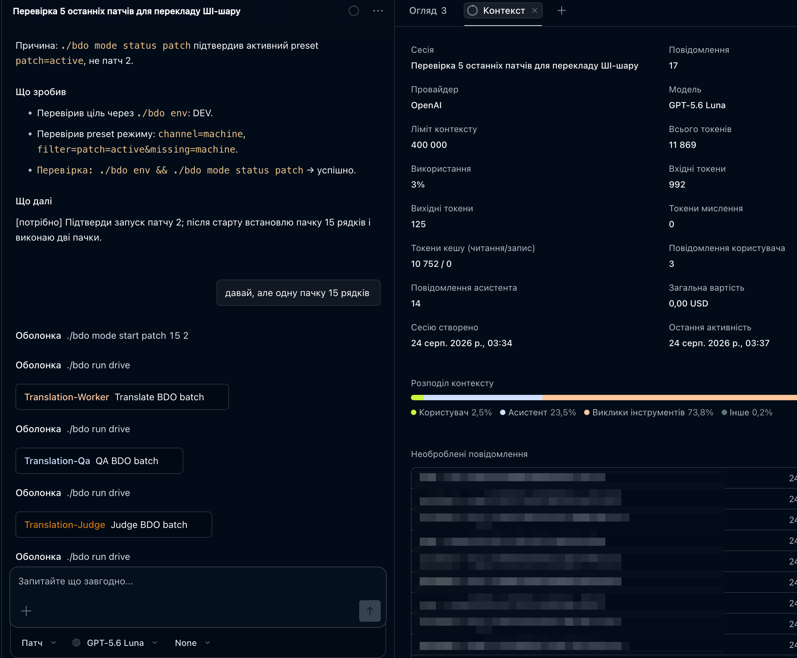
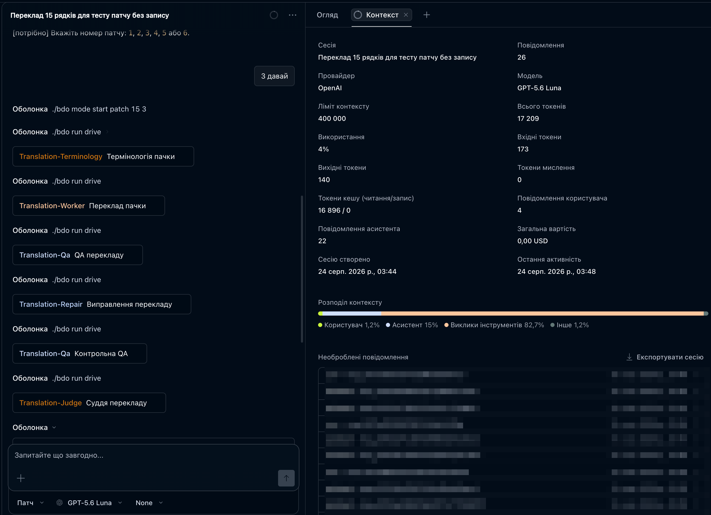
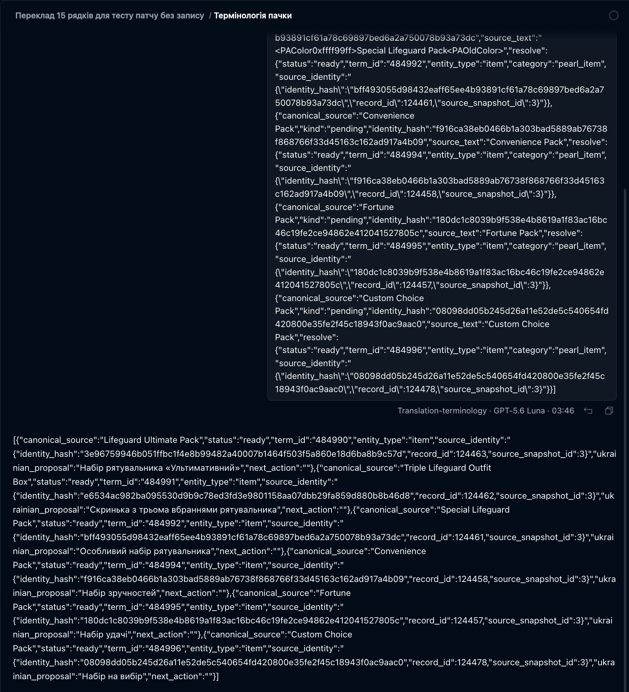
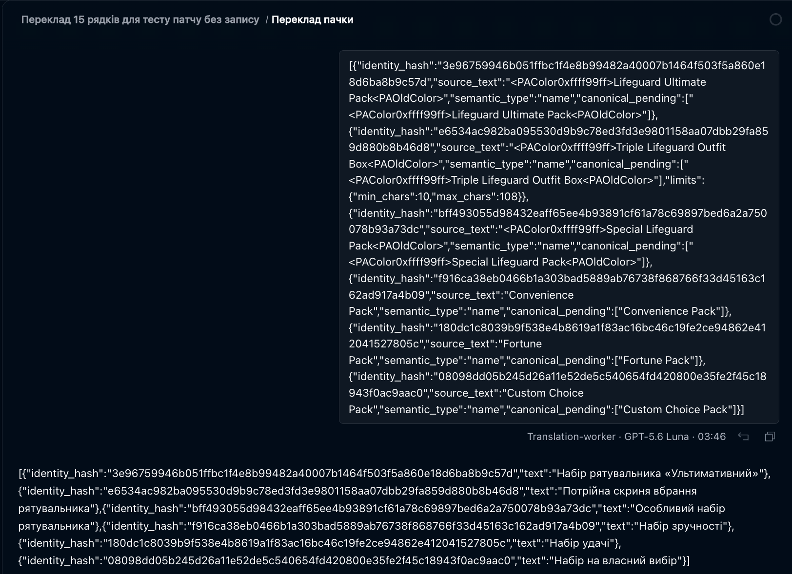
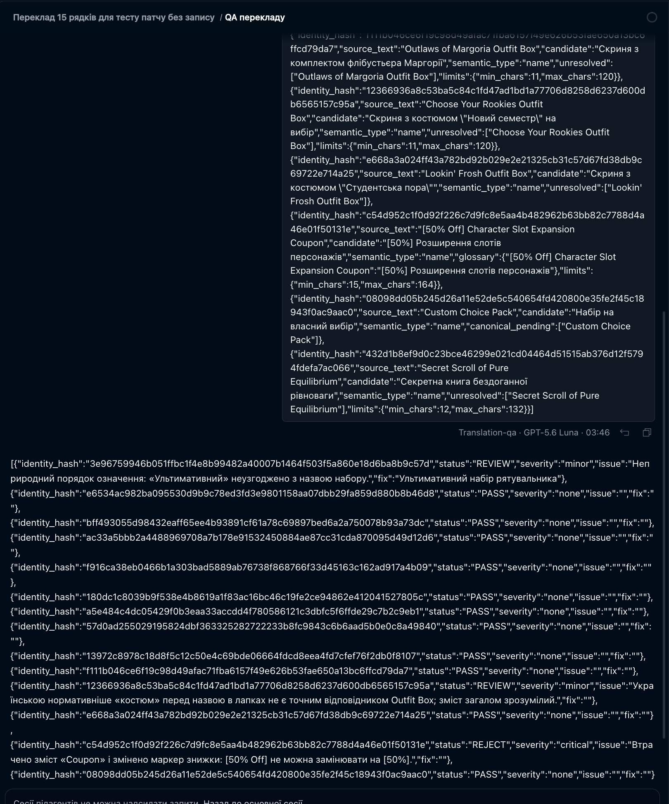
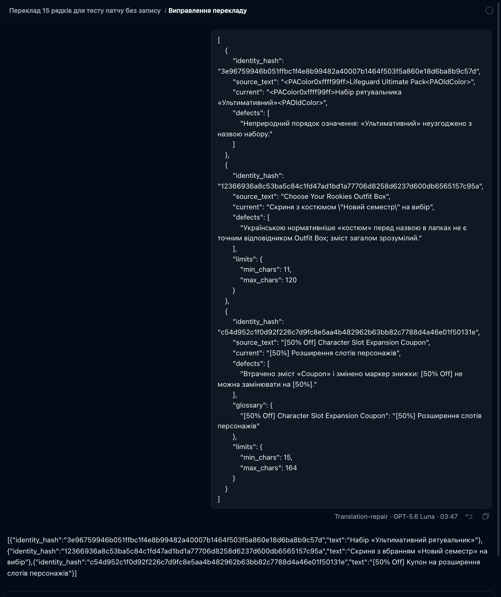
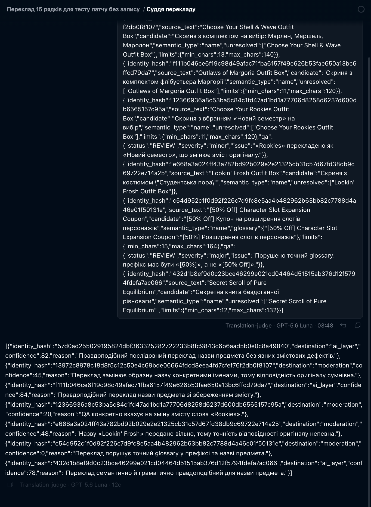

# bdo-ua-ai-localization


Набір інструментів для перекладу рядків **Black Desert Online** українською для
проєкту [BDO UA Translate](https://bdo-ua.com.ua).

Працює це так: ви запускаєте `./bdo`, вибираєте в меню режим і патч · далі
набір веде роботу сам. Порядок кроків тримає **скрипт**, мовну роботу роблять
**локальні моделі Ollama**, між кроками стоять детерміновані перевірки.

Перед записом кожен рядок проходить механічні перевірки: незмінність identity,
розмітка, placeholders, межі довжини, словник русизмів, латинські гомогліфи в
кирилиці.

## Про проєкт

- Робота починається з вибору режиму в меню: активний патч, ручний шар,
  пропозиції або поліпшення ШІ-шару. Драйвер веде всі пачки до нульового
  залишку через відновлюваний `run drive`.
- Мовну роботу роблять сім вузьких ролей на локальних GGUF-моделях. Оплати за
  токени немає взагалі.
- Формат відповіді ролі прибитий JSON-схемою, тому вона не може загубити,
  здублювати чи вигадати ідентифікатор рядка.
- Пачками по 50 рядків (допустимий діапазон 20-100), з памʼяттю перекладів і глосарієм.
  закривається без виклику моделі взагалі.
- У ШІ-шар пишеться все, що має текст. Черга модерації · для ручного шару, де
  проблемний рядок справді потребує людини.
- Один прогін · одне середовище, зафіксоване до першої пачки.
- Кожен крок має штатну команду `./bdo`; свій `curl` до API заборонений.

**Чого тут немає.** Це клієнт, а не сервер: ні бази даних, ні вебзастосунку, ні
адмінки, ні самого API. Уся серверна логіка живе в окремому проєкті, а цей набір
лише читає й пише через Agent API.

Повністю скриптовий флоу без чату колись існував, але **видалений** 2026-08-22:
робочий флоу один. Код лишився в історії Git · коміт `dac631e`.

## Моделі ролей

Мовну роботу роблять локальні моделі Ollama. Що саме бере кожна роль, задає
[`config/roles.json`](config/roles.json):

```json
{
  "endpoint": "http://127.0.0.1:11434",
  "default_model": "qwen3.6:35b-a3b-mtp-q4_K_M",
  "num_ctx": 131072,
  "roles": { "translation-qa": { "schema": "qa", "temperature": 0.1 } }
}
```

`default_model` діє на всі ролі; окремій ролі можна дати власну `model`.
Модель мусить бути у `ollama list` · інакше `./bdo runtime` зупиняє роботу
ДО пачки, а не посеред неї.

Заміряно 2026-08-28 на M1 Max (60 рядків EN→UA, 20 QA-кейсів, 10 repair):

| Модель | Переклад | QA | Придатність |
|---|---|---|---|
| `qwen3.6:35b-a3b-mtp-q4_K_M` | 97% | 0.90/0.90 | усі ролі, зокрема QA й суддя |
| `gemma4:26b-a4b-it-mtp-q4_K_M` | 93% | 0.00/0.00 | лише worker і repair |
| `gemma4:26b-a4b-it-q4_K_M` | 33% | 0.00/0.00 | у прогін не брати |

Думання вимкнене завжди: клієнт шле `think: false`. Для думальної моделі
«не сказано» означає ДУМАТИ, і тоді відповідь іде в `thinking`, а `content`
лишається порожній.

## Windows

Набір виконується всередині WSL2 · див. [`docs/WINDOWS_WSL2.md`](docs/WINDOWS_WSL2.md).

## Пов'язані проєкти

| Проєкт | Що це |
|---|---|
| [bdo-ua.com.ua](https://bdo-ua.com.ua) | сайт, адмінка, глосарій, черга модерації, Agent API |
| [bdo-ua-client](https://github.com/merelyigor/bdo-ua-client) | програма встановлення українізатора в гру |
| цей репозиторій | переклад рядків через Agent API локальними моделями |

Повний шлях до серверного проєкту можна задати в `.env` змінною
`TRANSLATE_PROJECT_ROOT`. Це необовʼязково й потрібно лише адміністратору, який
має серверний проєкт локально: шлях використовується для read-only документації
та контракту API. Агент не запускає в ньому Docker, Artisan, SQL/БД, тести й не
змінює файли; дані про патчі та переклади читає лише через Agent API. Якщо API
бракує можливості, агент готує окремий промпт за
[API_CHANGE_HANDOFF.md](docs/API_CHANGE_HANDOFF.md). Без зовнішнього проєкту
toolkit повністю працює через Agent API.

## Що потрібно

| Компонент | Вимога |
|---|---|
| Моделі ролей | [Ollama](https://ollama.com) з моделлю з `config/roles.json` |
| Ключ | Agent API key проєкту BDO UA Translate |
| Runtime | Bash, PHP CLI 8.3+, jq, curl, ShellCheck |
| Залізо | для моделі 35B-A3B потрібно ~22 ГБ вільної памʼяті |

Стороннього застосунку-оркестратора не потрібно: конвеєр веде сам набір.

MLX-моделі дозволені з 2026-08-28. Раніше вони були заборонені, бо тодішній
runner мовчки ігнорував обмеження формату; на Ollama 0.33.1 `gemma4:e4b-mlx`
дотримав strict-схему в 4 прогонах із 4. Формат моделі не вгадується за назвою
тега: його доводить `./bdo runtime` перед першою пачкою.

## Скільки це триває

Диригента немає, тому платних токенів у конвеєрі немає взагалі · рахунок іде в
годинах роботи локальної моделі.

Заміряно 2026-09-04 на живих пачках: ≈9,4 тис. вихідних токенів на пачку з 50
рядків, тобто **4-6 хвилин на пачку** й близько 600 рядків за годину. Патч на
30 тис. рядків · приблизно 50 годин безперервної роботи.

Це не вада, а причина існування драйвера: цикл працює вночі без жодного
«продовжуй».

## Основний користувацький workflow

Повний довідник команд доступний у [docs/COMMANDS.md](docs/COMMANDS.md) і
автоматично генерується з канонічного реєстру; ручна копія команд не потрібна.

Власник вручну змінює лише локальний `.env` і працює через меню `./bdo`.
Команди нижче · довідка для встановлення й діагностики, а не щоденний workflow.

Зупинений прогін продовжується з того самого кроку: стан пачки лежить на диску,
повторний старт пачки не потрібен.

## Підготовка середовища (внутрішній setup агента / розробника)

Наведені нижче shell-команди потрібні для одноразового setup чистого клону або
діагностики розробником. Це **не основний користувацький workflow**: власник
вручну змінює лише локальний `.env`, а далі повідомляє primary-режиму, що треба
продовжити. Primary сам матеріалізує runtime, запускає flow та перевірки.

1. Клонувати репозиторій і увімкнути запобіжники:

```bash
git clone https://github.com/merelyigor/bdo-ua-ai-localization.git
cd bdo-ua-ai-localization
git config core.hooksPath .githooks
```

2. Створити `.env` із шаблону й вписати ключ:

```bash
cp .env.example .env
```

Для найпростішого production-запуску можна взяти мінімальний шаблон без DEV,
адміністративного шляху та необовʼязкової ротації:

```bash
cp .env.minimal.example .env
```

Повний [`.env.example`](.env.example) містить усі необовʼязкові override-и для
DEV, локальних моделей, ротації та адміністрування повʼязаного серверного проєкту.

3. Матеріалізувати локальний generated runtime з tracked-шаблонів:

```bash
./bdo env
```

Runtime-файли ignored і створюються атомарно; профіль або модель можна змінити в
`.env`, повторити `./bdo env`, а Git diff від цього не зʼявиться.

Для запуску з PyCharm у корені є `Makefile` з target `env`. Додайте Makefile-конфігурацію
з target `env` або скористайтеся вбудованою підтримкою Makefile: target викликає
той самий канонічний `./bdo env` і не містить окремої логіки.

Target `sync` додатково показує зміни `.env` у форматі «було → стало», маскує
ключі та інші секрети, матеріалізує runtime і зберігає masked snapshot для
наступного порівняння. У PyCharm запускайте `make sync`, коли змінили профіль,
модель, `BDO_ENV`, API або параметри ротації.

4. Завантажити модель субагентів:

```bash
ollama pull qwen3.6:35b-a3b-mtp-q4_K_M
```

5. Перевірити, що все на місці:

```bash
./bdo gate preflight
./bdo gate runtime
./bdo gate agents
./bdo api
```

`preflight` покаже ціль прогону й розкладку, `runtime` перевірить локальну модель
за пʼятьма пунктами (останній · що кожна роль має промпт і модель), `agents` звірить
реєстр ролей із промптами, `./bdo api` зробить read-only запит до API.

`./bdo runtime` і є остаточним доказом: він викликає `cli/model/client.php` ·
той самий файл, який працює на пачці · і перевіряє, що модель дотримала
strict-схему й не зʼїла відповідь думанням.

## Ціль прогону: одна константа

`.env` потрібен рівно у два рядки:

```text
BDO_ENV=PROD
BDO_API_KEY_PROD=ваш-ключ
```

`BDO_ENV` керує і читанням, і записом. Перемикання середовища · правка **одного**
рядка: адресу API правити не треба, вона зашита в `cli/system/select-env.sh` як публічна
константа. У `.env` лишається тільки те, що справді різне у кожного · ключі.

Що стоїть зараз:

```bash
./bdo env
```

Прапорцем ціль не перемикається: якщо префікс `BDO_API_ENV=` суперечить файлу,
скрипт падає з обома значеннями в помилці замість того, щоб тихо піти не туди.

`BDO_ENV` задає і ціль, і дозвіл: окремо підтверджувати прод-запис не потрібно.
Свідома дія · правка `.env`. Диригент лише повідомляє ціль одним рядком перед
першою пачкою, а `./bdo run start` фіксує її, і `./bdo commit --write` звіряє з
нею кожну пачку.

Канонічна production-адреса — `https://bdo-ua.com.ua/api/agent/v1`. Для PROD
береться `BDO_API_BASE_PROD`, якщо його задано, інакше production default. Для DEV
береться лише `BDO_API_BASE_DEV`. Застарілий `BDO_API_BASE` ігнорується незалежно
від `BDO_ENV`.

## Хто працює: драйвер і сім ролей

Порядок кроків тримає [`cli/run/run-loop.sh`](cli/run/run-loop.sh). Він читає
конверт `./bdo run drive` і виконує його: `child` · виклик ролі, `retry` ·
пауза, `continue_run` · наступна пачка, `blocked` · зупинка з причиною. Жодна
модель не вирішує, що робити далі.

| Роль | Робота |
|---|---|
| `translation-terminology` | пропонує відповідники для невідомих термінів |
| `translation-worker` | перекладає рядки пачки |
| `translation-qa` | виносить вирок кожному рядку |
| `translation-repair` | виправляє рядки з вироком REVIEW/REJECT |
| `translation-judge` | вирішує маршрут спірного рядка (не текст) |
| `translation-glossary` | працює з чергою термінів |
| `translation-smoke` | перевіряє справність каналу |

Промпт кожної ролі · окремий самодостатній файл у [`roles/`](roles).
Формат відповіді прибитий JSON-схемою (`format` у Ollama), тому роль не може
загубити, здублювати чи вигадати ідентифікатор рядка.

Кожен виклик пише рядок у `state/model-calls.jsonl`: роль, модель, час, токени
й вирок. Це джерело правди для `./bdo audit`.

## Як перекладати

Робота починається з меню `./bdo`. Ніяких зовнішніх застосунків не потрібно.

### Швидкий старт

```bash
./bdo          # меню: режим, патч, категорія, кількість пачок
```

Далі набір працює сам. `Ctrl-C` зупиняє між кроками; продовжити можна пунктом
«продовжити» в тому ж меню.

Без меню, для розробника:

```bash
./bdo mode start патч 50 7   # почати пачку патча 7
./bdo loop                   # вести до кінця цілі
```

### Як виглядає обробка пачки

Після підтвердження пачки диригент послідовно показує child-сесії окремих ролей:

- спочатку готується термінологічна памʼять;
- `translation-worker` створює кандидат перекладу для кожного рядка;
- `translation-qa` перевіряє кандидатів;
- `translation-repair` виправляє названі дефекти, після чого QA повторюється;
- `translation-judge` вирішує, у який канал потрапляє остаточний результат.



На цьому етапі диригент не перекладає сам. Він фіксує ціль, розмір пачки та
порядок роботи, а потім створює видимі native child-сесії. На скріншоті видно,
що окремо запускаються `Translation-Worker`, `Translation-Qa` і
`Translation-Judge`.

Актуальний приклад повного flow для 50 рядків показує, як після старту пачки
послідовно зʼявляються термінолог, перекладач, тестувальник, ремонтник,
контрольний QA та суддя.



#### 1. `translation-terminology` — термінолог і укладач глосарія

Термінолог першим перевіряє назви та нові поняття через API, знаходить
канонічні відповідники й повертає пропозиції глосарія. Його результат стає
памʼяттю для перекладача та наступних перевірок; сам він переклад не записує.



#### 2. `translation-worker` — перекладач пачки

Перекладач отримує підготовлені рядки та термінологічну памʼять і створює
кандидатські переклади. Він не обирає канал запису: результат переходить до QA.



На цьому скріншоті відкрито сесію `Translate BDO batch
(@translation-worker subagent)`.

#### 3. `translation-qa` — тестувальник перекладу

Тестувальник перевіряє кожен кандидат: identity, placeholders, markup,
довжину, мовну якість та інші обмеження. Він повертає формальний вердикт і
визначає, чи потрібен ремонт.



На цьому скріншоті відкрито сесію `QA BDO batch
(@translation-qa subagent)`.

#### 4. `translation-repair` — ремонтник перекладу

Ремонтник отримує лише рядки й дефекти, названі QA, та виправляє конкретні
помилки, зберігаючи identity, markup і зміст.



Після Repair ті самі рядки обовʼязково проходять контрольний QA ще раз.

#### 5. Контрольний `translation-qa` — повторна перевірка

Контрольний QA підтверджує, що виправлення справді усунули дефекти й не
пошкодили інші обмеження. Лише після цього рядок передається судді.

#### 6. `translation-judge` — суддя перекладу

Суддя розбирає результати після QA, вирішує, що справді є проблемою, і
затверджує маршрут: `ai_layer`, `manual` або `proposal` на модерацію.



На цьому скріншоті відкрито сесію `Judge BDO batch
(@translation-judge subagent)`.

Пункт меню «журнал» показує кожен виклик моделі: роль, час, токени й вирок.
Те саме з терміналу дає `./bdo audit`.

`@` у чаті кличе СУБАГЕНТА (`@translation-smoke`), а диригент · це primary-агент
сесії, не `@`-виклик.

```text
переклади 50 рядків активного патча
переклади 5 пачок
перевір 50 рядків без запису
переклади назви предметів, у ручний шар
переклади весь патч до кінця
```

Ціль прогону він не вигадує й не питає: вона задана `BDO_ENV` у `.env`.
Про середовище він скаже вам одним рядком на початку.

**Що primary робить під капотом (внутрішні кроки, не основний користувацький workflow).** Знати це для роботи не потрібно · корисно,
коли щось пішло не так. Той самий список друкує `./bdo help flow`:

```bash
./bdo runtime                                   # перед першою пачкою
./bdo run start                                 # зафіксувати ціль прогону

./bdo fetch 15 "patch=active&missing=machine"   # +&exclude_proposed=1 лише для пропозицій
./bdo batch new rows.json                       # тека пачки; далі файли лише туди
./bdo memory find rows.json                     # чи вже перекладено цей оригінал
./bdo memory apply rows.json memory.json        # закрити такі рядки без моделі
./bdo glossary gaps rows.json                   # ЗАВЖДИ; читати останній рядок ВИРОК
./bdo payload terminology rows.json             # -> @translation-terminology, якщо є прогалини
                                                # resolve уже зроблений скриптом
./bdo schema build to-translate.json            # прибити формат відповіді
./bdo payload worker to-translate.json          # -> @translation-worker
./bdo memory expand candidate.json twins.json memory-candidate.json > full.json
./bdo normalize full.json > clean.json          # гомогліфи, безкоштовно
./bdo items rows.json clean.json items.json "" --require-all
./bdo russianisms clean.json rows.json
./bdo validate items.json

./bdo schema qa rows.json
./bdo payload qa rows.json clean.json           # -> @translation-qa
./bdo heal rows.json candidate.json verdicts.json validate.json
                                                # -> @translation-repair, ./bdo merge, контрольний QA
                                                # -> @translation-repair, потім контрольний QA
./bdo commit rows.json heal-merged.json verdicts.json --write
./bdo schema clear && ./bdo batch end
./bdo audit                                     # правда про сесії, не самозвіт
```

Максимум **шість субагентських сесій на пачку**: worker, QA, repair, контрольний
QA і terminology за потреби. Більше · помилка процесу.

Повний процес із причинами кожного кроку ·
[WORKFLOW.md](WORKFLOW.md).

## CLI-довідка для розробників і діагностики (не основний користувацький workflow)

Власник не запускає наведені команди вручну · він працює через меню `./bdo`.
Ці команди потрібні розробнику під час діагностики.

Єдиний вхід · `./bdo`. Без аргументів друкує все дерево з призначенням кожної
команди:

```bash
./bdo                 # дерево команд
./bdo help flow       # порядок однієї пачки
./bdo help fetch      # довідка самої команди
```

| Група | Команди |
|---|---|
| Прогін | `env`, `runtime`, `run start\|show\|end`, `gate` |
| Вибірка | `patch`, `fetch`, `show`, `context`, `subset` |
| Пачка | `batch new\|dir\|check\|end` |
| Підготовка | `memory find\|apply\|expand`, `glossary gaps\|resolve`, `schema`, `payload` |
| Перевірка | `normalize`, `items`, `russianisms`, `validate` |
| Лікування | `heal`, `qa-fixes`, `merge` |
| Завершення | `commit`, `write`, `moderation` |
| Обслуговування | `audit`, `profile`, `models`, `bench`, `clean`, `paths` |

Скрипти в корені лишаються реалізацією підкоманд і працюють при прямому виклику,
але штатний шлях · через `bdo`.

## Чому роль не може піти не туди

- **Payload приходить файлом.** Його готує рушій; ніхто його не переказує й не
  відновлює по памʼяті. У версії з диригентом саме переказ дав 174 порушення
  контракту.
- **Схема прибита.** `format` у Ollama · це constrained decoding: чужий ключ або
  чужий `identity_hash` фізично не можуть зʼявитись у відповіді.
- **Мовчазної деградації немає.** Порожній `content`, обрив на стелі, чужа
  схема, переповнене вікно · кожне з цього дає окрему машинно-читану причину й
  зупиняє крок.
- **Порядок кроків не залежить від здогаду.** Дозволені переходи описані в
  [`lib/Pipeline/StateMachine.php`](lib/Pipeline/StateMachine.php), а драйвер
  лише виконує те, що віддав рушій.

## Agent API

Набір спілкується з сайтом рівно через ці ендпоінти:

| Ендпоінт | Навіщо |
|---|---|
| `GET /me` | роль, здатності, залишок денної квоти |
| `GET /rows` | вибірка рядків на переклад |
| `GET /rows/{hash}/context` | затверджені приклади зі спільним терміном |
| `GET /patch/summary` | скільки в патчі лишилось |
| `GET /taxonomy`, `GET /guide` | категорії рядків і машинна інструкція |
| `POST /translations/memory` | чи вже перекладено цей оригінал |
| `POST /glossary/terms/resolve` | канонічний відповідник терміна |
| `POST /translations/validate` | серверна перевірка до запису |
| `POST /translations` | запис перекладу |
| `GET /translations/proposals` | черга модерації |

Параметри, тіла запитів і коди помилок · [docs/API.md](docs/API.md). Контракт
запису й вимоги до ролі · [API_WRITE_CONTRACT.md](API_WRITE_CONTRACT.md).

## Канали запису

| Канал | Куди | Коли |
|---|---|---|
| `machine` | ШІ-шар напряму | звичайна пачка, за замовчуванням |
| `manual` | ручний шар за дозволами ключа; проблемне автоматично в proposal | «як людина» із запобіжником |
| `proposal` | черга модерації без auto-approve | уся пачка на розгляд людини |

Маршрут вирішує **канал**, а не вирок QA:

- `machine` · пишеться все, що має текст. Модерація не задіюється взагалі, бо
  ШІ-шар для того й окремий шар. Поганий текст лікує `repair` і лягає в шар як
  є; у карантин іде лише порожній рядок · це збій, а не питання якості.
- `manual` · чисте йде як ручна пропозиція з `auto_approve=true`, тому сервер
  схвалює її лише коли API-ключ має відповідний дозвіл; без нього всі чисті
  рядки лишаються proposal на модерацію. Справді проблемне (`major`, `critical`,
  `REJECT`) завжди йде з `auto_approve=false`.
- `proposal` · окремий режим, у якому вся непорожня пачка одразу йде на
  модерацію з `auto_approve=false`, незалежно від QA-статусу та дозволів ключа.

Технічно зламане не пройде в жодному каналі: identity, розмітку, `keep` і межі
довжини перевіряє гейт до запису, а потім ще й сервер. Нова назва предмета
дефектом не є і в ШІ-шарі в модерацію не йде.

## Перевірки

Це довідник для розробника. У звичайному agent flow ці перевірки запускає
primary сам; власнику не потрібно виконувати bash-команди вручну.

```bash
./bdo gate preflight  # середовище, ціль прогону, розкладка, правила
./bdo gate docs       # правила, плани, посилання, публічна безпека
./bdo gate shell      # bash, ShellCheck, PHP syntax
./bdo gate agents     # ролі конвеєра, драйвер, TUI і клієнт моделі
./bdo gate runtime    # локальна модель, 5 пунктів
./bdo gate api        # read-only запит до API
./bdo gate full       # усі локальні детерміновані перевірки
```

Гейт нічого не пише в API, не деплоїть, не видаляє стан і не змінює Git.

## Безпека

Репозиторій публічний, і видалення значення новим комітом не прибирає його з
історії.

- Ключі живуть лише в локальному `.env`, який Git ігнорує. У репозиторії є тільки
  `.env.example` з порожніми ключами.
- `.githooks/pre-commit` перевіряє застейджений вміст на значення з вашого `.env`
  і на типові патерни секретів. Він ловить не сам файл, а вставлений у README
  приклад із справжнім ключем · саме так ключі й витікають.
- `output/` і `state/` локальні й не комітяться.
- `./bdo clean` за замовчуванням лише показує ротацію. Він видаляє тільки старі
  похідні файли будь-якої теки пачки, на яку не вказує `state/current-batch`:
  така тека недосяжна для флоу незалежно від її стану. Лишається квитанція
  (`manifest.json`, `journal.jsonl`, `batch-summary.json`), а понад
  `BDO_KEEP_RECEIPTS` (50) тека видаляється цілком. Поточна пачка не чіпається
  ніколи. Прибирання УВІМКНЕНЕ за замовчуванням після кожної завершеної пачки;
  `BDO_AUTO_CLEAN=0` · аварійний вимикач. `quarantine.jsonl` та
  `write-log.jsonl` не видаляються.
- `identity_hash` і `source_hash` не є секретами: це технічні ідентифікатори
  контракту.

Повний контракт і порядок дій при витоку · [docs/SECURITY.md](docs/SECURITY.md).

## Питання та проблеми

**Роль не відповідає.** Клієнт моделі не мовчить: він друкує причину
(`model_unreachable`, `empty_content`, `truncated`, `not_json`,
`context_overflow`) і зупиняє крок. Причина потрапляє й у
`state/model-calls.jsonl`, тому її видно в `./bdo audit` після факту.

**Наступна пачка дає ті самі рядки, що попередня.** У вибірці немає
`missing=machine`. Заливка ШІ навмисно не рухає лічильник «опрацьовано», тому
вже перекладені рядки лишаються у вибірці. `./bdo fetch` додає фільтр сам, якщо
його не задано явно.

**API відповідає `active_proposal_exists` на всю пачку.** Так буває лише коли
пачка пише ПРОПОЗИЦІЇ: у цього автора для цих рядків уже є відкриті. Додайте
`exclude_proposed=1` у вибірку. При записі в ШІ-шар ця помилка не виникає ·
шари незалежні, і відкрита ручна пропозиція машинному запису не перешкоджає.

**Змінив промпт ролі · чи треба щось перезапускати.** Ні. Промпт читається з
диска на кожному виклику, тому наступний крок уже піде новим текстом.

**Модель написала латинську `E` всередині українського слова.** Це зламаний
символ, не стиль: `./bdo normalize` виправляє його детерміновано й безкоштовно,
до всіх перевірок.

**Не знаю, що насправді робили моделі.** `./bdo audit` читає власний журнал
`state/model-calls.jsonl` і показує роль, модель, токени, час і вирок кожного
виклику. Самозвіт моделі цим не замінюється.

**У чаті червона помилка плагіна про схему.** Це не збій, а запобіжник: воркер
або QA викликано без поставленої схеми пачки. Плагін спиняє запит до витрати
токенів. Лікується `./bdo schema build` (або `./bdo schema qa`) для потрібної
пачки.

**Субагент відповів прозою замість JSON.** Схема не діяла. Дві причини:
або він викликав інструмент (тоді constrained decoding вимикається), або модель
не GGUF. Перевірка · `./bdo gate agents` і `./bdo runtime`.

**QA повернув менше вердиктів, ніж рядків у пачці.** Це збій QA, а не висновок
про якість. Пачку не писати, QA повторити з тим самим payload.

**Гейт `api` дає 401.** Ключ у `.env` недійсний для середовища, яке задане в
`BDO_ENV`.

## Структура

```text
bdo                         єдиний вхід: ./bdo · меню, ./bdo help · дерево команд
bin/tui.sh                  термінальне меню й екрани стану
roles/translation-*.md      промпт кожної ролі · самодостатній, без include
config/roles.json           модель, схема й температура кожної ролі
cli/run/run-loop.sh         драйвер: виконує конверт `run drive`
cli/model/client.php        виклик локальної моделі під strict-схемою
cli/{api,batch,prepare,quality,heal,write,run,runtime,audit,system}/
                            реалізація підкоманд за доменами
lib/                        PHP: identity, пачки, якість, машина станів, API
scripts/agent-check.sh      єдиний quality gate
docs/                       довідники, API, виміри, плани
legacy/                     архів версії на оркестрації OpenCode (ignored)
state/                      робочий стан прогонів, пачок і журнал викликів моделі
output/                     відповіді API, бенчмарки, квитанції запису
```

Версія набору на оркестрації OpenCode законсервована: тег `v3.0.6-opencode`,
гілка `legacy/opencode`. Відновити · `git checkout v3.0.6-opencode`.

## Документація

| Потреба | Документ |
|---|---|
| Призначення, межі, структура | [docs/PROJECT_OVERVIEW.md](docs/PROJECT_OVERVIEW.md) |
| Ендпоінти й параметри API | [docs/API.md](docs/API.md) |
| Контракт запису | [API_WRITE_CONTRACT.md](API_WRITE_CONTRACT.md) |
| Повний процес перекладу | [WORKFLOW.md](WORKFLOW.md) |
| Виміри, інциденти, рішення | [docs/FLOW_STATE.md](docs/FLOW_STATE.md) |
| Публічна безпека | [docs/SECURITY.md](docs/SECURITY.md) |
| Правила для AI-агентів | [AGENTS.md](AGENTS.md), [docs/AI_AGENT_RULES_REFERENCE.md](docs/AI_AGENT_RULES_REFERENCE.md) |
| Плани й черга робіт | [docs/plans/README.md](docs/plans/README.md), [docs/plans/BACKLOG.md](docs/plans/BACKLOG.md) |
| Виміри, інциденти, рішення | [docs/FLOW_STATE.md](docs/FLOW_STATE.md) |

Уся навігація по документації · [docs/README.md](docs/README.md).

## Ліцензія

MIT · [LICENSE](LICENSE).
