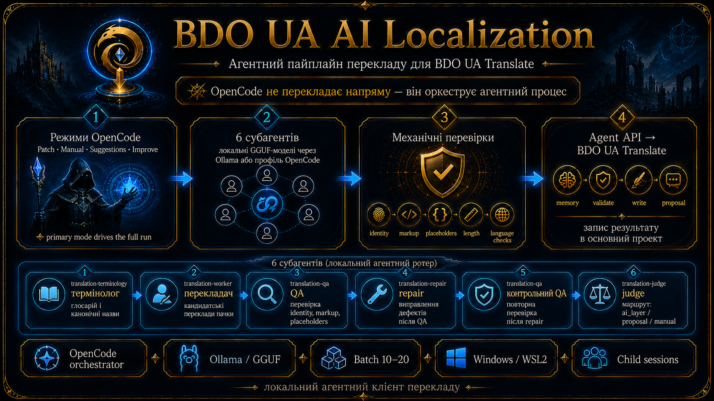

# BDO UA Translate · ШІ-переклад Black Desert Online українською

<!-- Банер: docs/assets/banner.png (ширина 935). Розкоментуй рядок нижче, коли файл буде в репозиторії.

-->

Локальна програма, яка перекладає тексти **Black Desert Online** українською
для спільноти [BDO UA Translate](https://bdo-ua.com.ua). Вона бере рядки гри
через Agent API сайту, перекладає їх обраною моделлю ШІ, перевіряє кожен рядок
кодом і лише тоді записує переклад на сайт. Сумнівне не пишеться: воно йде в
чергу до людини.

Усе керування відбувається в браузері, команди складати не треба. Сайт тримає
базу рядків, глосарій, модерацію й адмінку, а програма лише клієнт до нього.

## Чому саме так

- **Порядок кроків тримає код, а не модель.** Модель виконує лише мовну роботу
  однієї ролі. Вона не має інструментів, не керує процесом і відповідає JSON за
  жорсткою схемою, тож «творчо» зламати конвеєр не може.
- **Механічні перевірки сильніші за думку моделі.** Навіть коли модель каже
  «добре», зламаний placeholder, розмітка чи перенос рядка не пройдуть до запису.
- **Нічого не зникає мовчки.** Проблемний рядок іде в чергу до людини, збій
  мережі чи моделі відправляє рядок у карантин, а кожна відмова має машиночитану
  причину, яку видно на екрані.
- **Дані гри в безпеці.** Модель не бачить ідентифікаторів рядків (замість
  хешів вона отримує короткі `r1`, `r2`), і їй іде лише мінімальний текст пачки.
  Ключі й журнали ніколи не потрапляють до моделі.
- **Будь-яка модель.** Хмарна OpenCode Go, будь-який сервіс, сумісний з OpenAI,
  або локальні Ollama, oMLX і llama-swap на вашому залізі. Модель обирається
  на екрані без правки коду, і перед першою пачкою програма перевіряє, чи вона
  відповідає.
- **Видно все.** Прогін наживо, кожен виклик моделі з запитом, роздумами й
  відповіддю, статистика часу, порівняння двох моделей на тих самих рядках.
- **Переклад підписаний.** Кожен запис несе модель, провайдера й версію
  програми, тож пізніше можна покращити лише те, що перекладала старша версія.

## Як перекладається пачка

Пачка рядків проходить фіксований шлях. Кожен крок читає вхід із локальної
бази SQLite, робить свою роботу й записує результат, перш ніж іде далі. Стан
однієї пачки не змішується з іншою, а черга рядків рухається далі лише після
того, як пачка завершилась.

```text
рядки з API → памʼять перекладів → термінолог → перекладач → механічні перевірки
  → контроль якості → ремонт (за потреби) → суддя → назви → validate сайту → запис
```

### Ролі моделі

| Роль | Що робить |
|---|---|
| Термінолог (`translation-terminology`) | зіставляє терміни пачки з глосарієм сайту й пропонує відповідник для нових |
| Перекладач (`translation-worker`) | перекладає рядки з урахуванням глосарія, памʼяті перекладів і контексту гри |
| Контроль якості (`translation-qa`) | читає переклад і позначає дефекти: сенс, стиль, терміни |
| Ремонт (`translation-repair`) | виправляє лише ті рядки, які відхилили перевірки, і лише названі дефекти |
| Суддя (`translation-judge`) | вирішує долю готового рядка: запис чи черга до людини, з оцінкою впевненості |
| Назви (`translation-names`) | вказує, де стоять назви гри; підставляє затверджені відповідники вже код |

Промпти ролей лежать у [`roles/`](roles/), схеми відповідей · у
[`roles/schema/`](roles/schema/). Кожен промпт самодостатній і розрахований
на слабшу модель, тому працює й на локальних.

### Механічні перевірки

Кодом, без моделі, перевіряється кожен рядок:

- placeholders, PA-розмітка, переноси `{BDO_NL}` і структура переліків;
- довжина відносно обмежень рядка;
- латиниця й цифри, схожі на кирилицю (гомогліфи), та чужі писемності;
- русизми й кальки з підказкою правильного слова;
- регістр і вжиток термінів глосарія з урахуванням української морфології;
- і наостанок · `validate` на сайті.

Зациклену відповідь моделі програма ловить за повторами фрагментів, а не
обрізанням: обсяг відповіді й роздумів моделі не обмежується.

## Режими прогону

| Режим | Що бере | Куди пише |
|---|---|---|
| патч (`patch`) | нові рядки патча | ШІ-шар (`machine`) |
| актуалізація (`refresh`) | рядки ШІ-шару, де змінився англійський оригінал | ШІ-шар |
| покращення (`improve`) | уже перекладений ШІ-шар, який ця програма ще не покращувала; можна обрати лише рядки від старших версій програми | ШІ-шар |
| ручний (`manual`) | ручний шар, якщо сервер дозволяє | ручний шар (`manual`) |
| пропозиції (`proposals`) | відкриті пропозиції з черги до людини, повторно | ШІ-шар, якщо рядок тепер чистий; інакше нова пропозиція замість старої |

Кожен режим можна спершу запустити як dry-run: програма пройде весь шлях, але
нічого не запише.

## Швидкий старт

### Що потрібно

1. [`uv`](https://docs.astral.sh/uv/). Python потрібної версії (3.13+) `uv`
   поставить сам.
2. **Ключ Agent API.** Його отримує будь-який користувач сайту: напишіть
   адміністратору або в [Discord спільноти](https://discord.gg/SJEP23tsUv)
   (посилання є й на [сайті](https://bdo-ua.com.ua)). Ключ потім видно в
   кабінеті: [`bdo-ua.com.ua/admin/profile`](https://bdo-ua.com.ua/admin/profile)
   → «API доступ» → «Показати» (починається з `bdo_`).
3. **Модель.** Одне з: ключ OpenCode Go, адреса й ключ
   сервісу, сумісного з OpenAI, або локальні Ollama, oMLX чи llama-swap.

### Запуск

```bash
git clone https://github.com/merelyigor/bdo-ua-ai-localization.git
cd bdo-ua-ai-localization
uv sync
uv run bdo web start
```

1. Під час першого запуску файл `.env` створюється сам, а браузер відкриває
   екран «підключення». Вставте туди ключ Agent API і, за потреби, адреси
   локальних моделей.
2. На екрані «моделі» додайте ключ моделі й оберіть активну модель. Там же
   видно ліміти підписки й рівень роздумів для кожної ролі.
3. На «Старті» оберіть режим, патч і розмір пачки й натисніть «почати прогін».
   **Спершу dry-run:** програма одразу працює з робочим сайтом (PROD), і
   запис без dry-run потрапить у справжній переклад.

Сторінка живе на `http://127.0.0.1:7660/` (порт змінює `BDO_WEB_PORT` у `.env`).
Зупинити сервер · `uv run bdo web stop`.

### Значок для macOS

Зібраний значок `BDO.app` лежить у корені репозиторію; перетягніть його в Dock,
не переміщуючи з кореня. Клік піднімає сервер і відкриває вікно з адресою,
версією й середовищем та кнопками «Відкрити в браузері», «Перезапустити сервер»
і «Сховати». Вкладка браузера сама не відкривається. Перезібрати значок ·
`uv run bdo app build`.

### Платформи

Перевірено на macOS. Windows і Linux **не перевірено**; підтримку додамо, коли
виникне потреба. Допомога з Windows вітається, але лише через pull request, який
пройде перевірку.

## Екрани

| Група | Шлях і назва | Що показує |
|---|---|---|
| Робота | `/run` · прогін | стан сесії й пачки, події та виклики ролей наживо, рядки й причини відмов |
| Робота | `/review` · черга до людини | пропозиції перекладу з моделлю й датою, пошук, схвалення або відхилення |
| Робота | `/sessions` · сесії роботи | історію сесій, пачок і причини завершення |
| Робота | `/start` · почати прогін | середовище, режим, патч, розмір і кількість пачок, dry-run або запис |
| Робота | `/models` · моделі | провайдери, активну модель, роздуми на роль, перевірки моделі й ліміти |
| Робота | `/history?hash=<hash>` · історія рядка | версії ШІ-шару й ручного шару: хто, якою моделлю й коли |
| Діагностика | `/setup` · підключення | ключі Agent API, адреси й ключі локальних моделей |
| Діагностика | `/status` · стан | середовище, хост API, стан ключа, версію |
| Діагностика | `/api` · API | `/me`, рядки, контекст, памʼять, validate та помилки API |
| Діагностика | `/calls` · виклики | журнал викликів моделей; кожен рядок веде до деталей |
| Діагностика | `/call?id=<id>` · деталі виклику | запит, роздуми й відповідь моделі, розібраний JSON та повтор виклику |
| Діагностика | `/quality` · якість | механічні перевірки на прикладах зламаного тексту |
| Діагностика | `/queue` · карантин і запис | відкладені рядки, карантин, модерацію, записи й ключі повтору |
| Діагностика | `/stats` · статистика | час ролей і пачок, порівняння з попередником та A/B повтор |
| Діагностика | `/compare` · порівняти моделі | ті самі рядки на двох моделях поруч |

`/` веде на `/setup`, поки не задано ключ Agent API, далі · на `/run`.

## Дані й безпека

- Ключі живуть лише в локальному `.env` (під `.gitignore`); сторінка їхніх
  значень не показує. Шаблон змінних · [`.env.example`](.env.example).
- Увесь стан · один файл `.bdo/bdo.sqlite`; там же журнал сервера. Тека `.bdo/`
  у git не потрапляє.
- Безкоштовним віддаленим моделям іде лише текст рядків гри, ніколи ключі чи
  журнали. Правила публічного репозиторію · [`docs/SECURITY.md`](docs/SECURITY.md).

## Документація

| Потреба | Де |
|---|---|
| Agent API: що можна робити, запити й відповіді | [документація API на сайті](https://bdo-ua.com.ua/docs/api/what-you-can-do); у репозиторії · [`docs/API.md`](docs/API.md), [`docs/API_WRITE_CONTRACT.md`](docs/API_WRITE_CONTRACT.md) |
| Архітектура, життя пачки, таблиці SQLite | [`docs/ARCHITECTURE.md`](docs/ARCHITECTURE.md) |
| Ухвалені технічні рішення | [`docs/DECISIONS.md`](docs/DECISIONS.md) |
| Безпека й класи даних | [`docs/SECURITY.md`](docs/SECURITY.md) |
| Уроки PHP-попередника й перехід із нього | [`docs/LESSONS_FROM_PHP.md`](docs/LESSONS_FROM_PHP.md), [`docs/MIGRATION.md`](docs/MIGRATION.md) |
| Плани, дефекти, журнал сесій | [`docs/plans/README.md`](docs/plans/README.md), [`docs/plans/DEFECTS.md`](docs/plans/DEFECTS.md), [`docs/plans/PROGRESS.md`](docs/plans/PROGRESS.md) |

## Для розробника

Код пишуть агенти за планами; правила · [`AGENTS.md`](AGENTS.md) (канон) і
побайтова копія `CLAUDE.md`, деталі · [`docs/RULES_REFERENCE.md`](docs/RULES_REFERENCE.md).
Автотестів немає: кожен крок перевіряється у справжньому браузері на живих
даних середовища розробки (DEV). Pull request приймається після такої ж
перевірки й зеленого `gate`.

```bash
git config core.hooksPath .githooks   # формат комітів, секрети, особисті дані
uv run bdo gate                       # secrets, docs, lint, types · за секунди
uv run bdo web restart                # перезапуск сервера без нової вкладки
uv run bdo version                    # версія пакета = рядок 1 коміту
```

Промпт для сесії агента-розробника:

```text
Прочитай AGENTS.md, docs/PLANNING.md і docs/plans/README.md. Візьми активний
план, прочитай його заголовок і «Instructions for the executor», почни з
першого кроку зі статусом не done. Працюй лише за планом. Наприкінці · звіт
за форматом AGENTS.md.
```

| Шлях | Що |
|---|---|
| `src/bdo_translate/` | код: конвеєр, клієнт API, моделі, перевірки, вебсторінка, `bdo` CLI |
| `roles/`, `roles/schema/` | промпти ролей і JSON-схеми відповідей |
| `config/roles.json`, `config/modes.json` | параметри ролей; режими прогону й канали запису |
| `docs/`, `docs/plans/` | довідник, рішення, архітектура, плани й реєстри |
| `reference/` | карта попередника, форми payload, знімки старого інтерфейсу |
| `scripts/executor/` | Бригада: виконавці й помічники для агентів ([`docs/EXECUTOR_HARNESS.md`](docs/EXECUTOR_HARNESS.md)) |
| `BDO.app` | зібраний значок macOS, переносний |

## Повʼязані проєкти

| Проєкт | Роль |
|---|---|
| [bdo-ua.com.ua](https://bdo-ua.com.ua) | сайт, глосарій, модерація й Agent API |
| [bdo-ua-client](https://github.com/merelyigor/bdo-ua-client) | встановлення українізатора в гру |
| [Discord спільноти](https://discord.gg/SJEP23tsUv) | питання, ключі Agent API, допомога |

## Ліцензія

MIT · [`LICENSE`](LICENSE). Сторонні компоненти та їхні ліцензії ·
[`THIRD_PARTY_NOTICES.md`](THIRD_PARTY_NOTICES.md).
